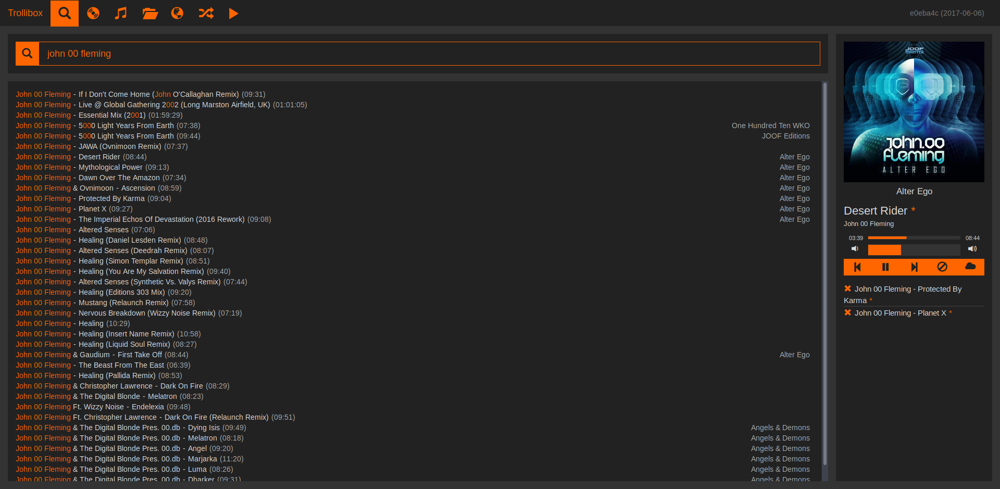
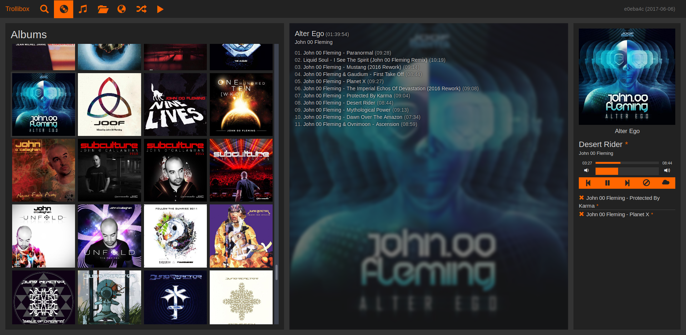
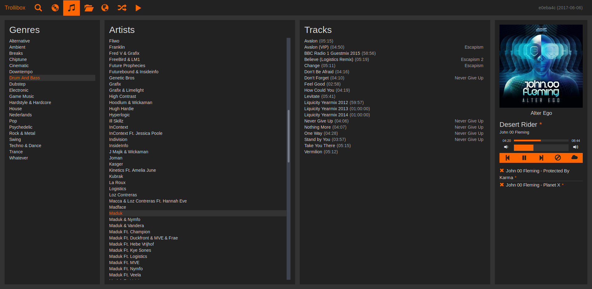
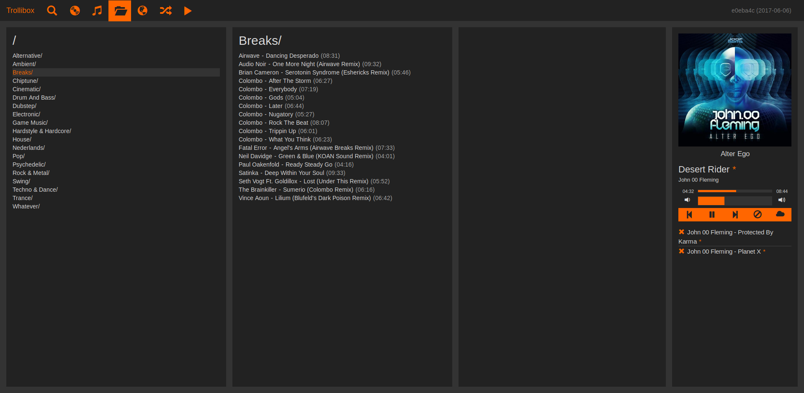
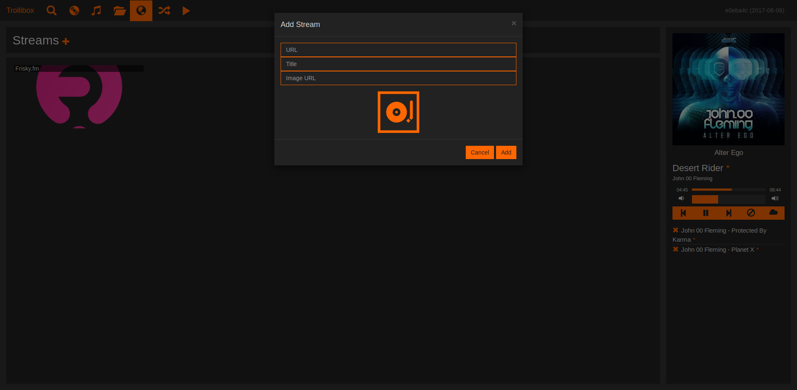
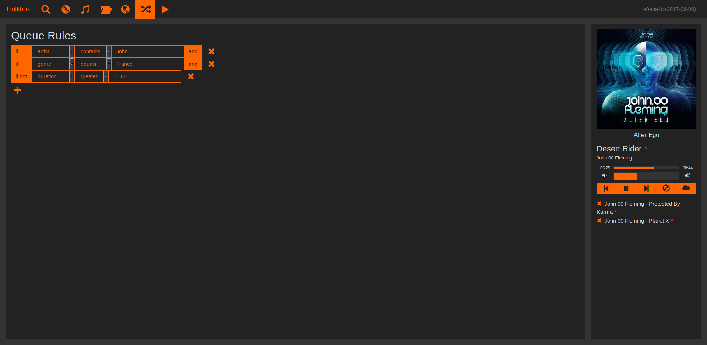

Trollibox
=========

The hackerspace friendly ~~MPD~~ music player web client.

Features:
* Control multiple music players from one webinterface
* Support for MPD
* Support for Logitech SlimServer and SqueezeBoxes
* Track art
* Listen to web radio stations
* Search-as-you-type for tracks
* Filebrowser
* Albumbrowser
* Queue random tracks when the playlist is done.
* Free Open Source Software (GPLv3)

## Installing
We're not using semantic versioning yet, but it is safe to install from the
master branch. Altough this also means that some things (like the stored stream
database) may break if you update it.

### Building
Clone the repository.

The following tools are required to build Trollibox:
* [Golang](https://golang.org/)

Once you got that sorted out, its time to build Trollibox. Build it by simply running:
```sh
# Install dependencies
./just install

# Build a release version of Trollibox containing all of its assets.
RELEASE=1 ./just build
```

### Configuring
Copy the [example configuration](config.example.json) to config.json, its
default location. If you want to use a custom location for the config file, you
should inform Trollibox by using the `-conf` option. Like this:
```sh
trollibox -conf /etc/trollibox.json
```

Inside the configuration file, you will find some options you may need to change.
```

### Track Art and MPD
Since MPD does not natively support art embedded in tracks, track art is
presented to Trollibox through stickers. These stickers need to be added by
running the [enclosed python script](support/mpd-artwork.py). It will look for
the art embedded in the track.

The script requires Python3 and the pillow, python-mpd2 and mutagen packages,
the lather 3 can be installed using pip. You also may need to adjust the
reference to MPD's config file, `MPD_CONF`. By default it will look for
`~/.mpdconf`.


## For Users

### Queueing Tracks
Tracks may be queued from the browser page using one of the views. Click on a
track to append it to the queue.

An asterisk will be displayed next to tracks that have been queued by users.
This feature originated at the [Bitlair Hackerspace](https://bitlair.nl/) where
tracks should not be skipped when they are queued by users.

### The Queuer
If the queue runs out of tracks, Trollibox will pick a random track from the
library and play it. The selection bias for tracks can be configured by setting
one or more rules on the Queuer page.

Such rules consist of simple expressions that evaluate to a boolean value. A
track must pass all rules set for it to be eligible for playing.

The `matches` operation takes a regular expression in
[Go's regexp format](https://golang.org/pkg/regexp/syntax/).

### Streams
Trollibox has support for HTTP streams. You can create a custom collection
using the Streams interface.

### Searching
The search view allows you to search the whole library of the current player
for tracks whose artist, title or album attributes contain some keywords.

Searching is case insensitive.

A track must match all keywords in order to end up in the results.

The search string is split on each space, unless you escape it with a
backslash: `foo\ bar`.

You can use wildcards too: `foo*bar`.

You can annotate the keywords in your query to search other fields,
You can limit a keyword to a single attribute by annotating them like this:
```
photographer genre:trance
```
The string `photographer` will be applied to the default attributes while the
genre must match "trance".

Available attributes are:
* uri
* artist (default)
* title (default)
* genre
* album (default)
* albumartist
* albumtrack
* albumdisc

## Q & A

#### What does the asterisk next to queued tracks indicate?
See [Queueing Tracks](#queueing-tracks).

#### Where is the button to update the library?
There isn't. Trollibox is only a browser/player. Managing the files of the
library is out of the scope of this project, which includes updating the
player's database.

#### How do I add stuff to the library?
Using whatever options the player you are using is giving you. Trollibox is
only a browser/player. You should manage your library in some other way.

#### I can't see the player on my phone.
The player is hidden on small screens to preserve space. The player is
accessible on a separate view for such devices.


## Screenshots











